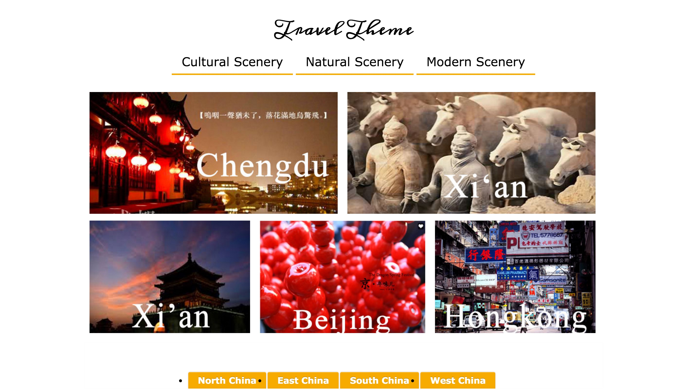
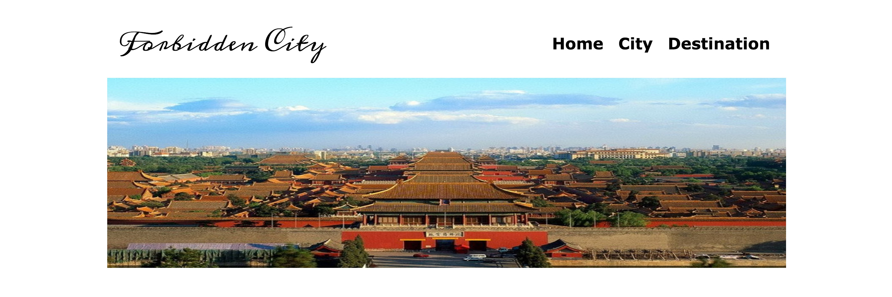
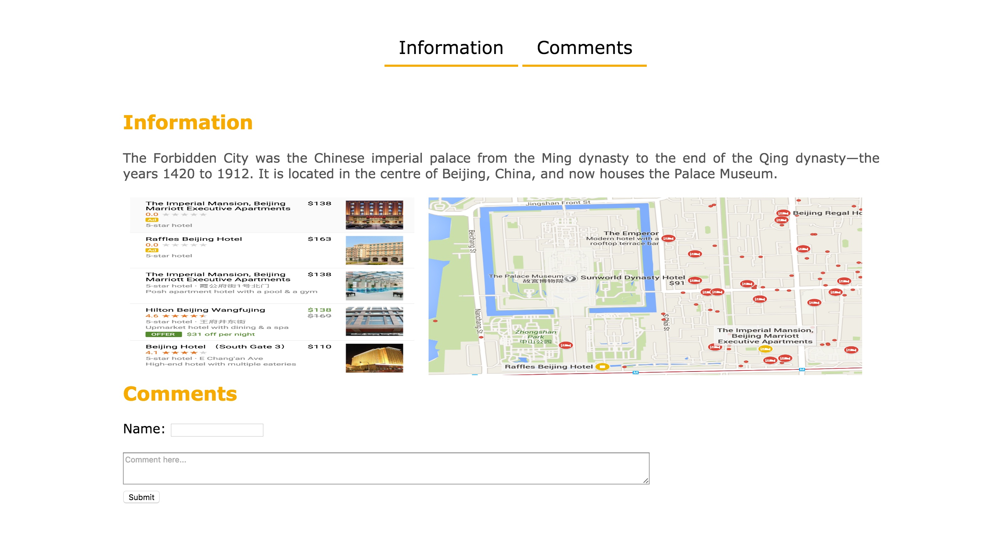

# tourists
(Group project with one participant)

This website tries to collect information of famous scenic spots in major cities of China. There are four important tasks that users can do at this website. 

First, users can find tourist cities of China which they are interested in at the home page. The target users are in English speaking countries and can be divided into two types. The first type, people who have had basic information on Chinese major cities. For example, they know several cities’ names and general locations. These users can use the menu to choose cities which is at the bottom of the home page. The second type, people who have no ideas on Chinese cities. They can choose cities according to the travel theme which they are interested in.

#

Second, both types of users will reach the corresponding city page via clicking the city’s name at the main page. Users can get the city information and the scenic spots list in the city ranked by previous travelers’ comments.

#

Third, users can reach the scenic spot page by clicking the spot’s item in the scenic spots list in the city page. Then users will get the scenic spot information and view the detail comments.

#

Last, users can open the comment page and write a comment by clicking the corresponding button at the scenic spot page.
